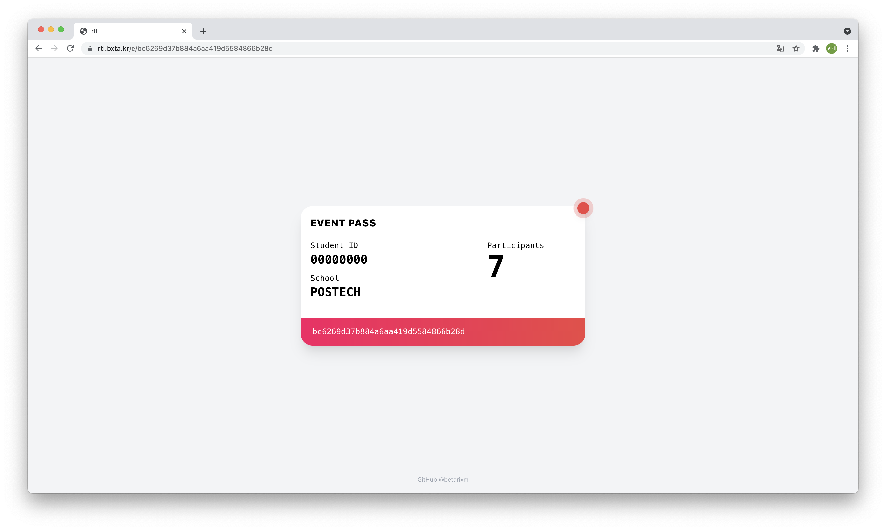

# rtl

[](https://cse.postech.ac.kr)



`rtl` is realtime lottery framework for POSTECH. It selects one of the participants counted in realtime
using [Django Channels](https://github.com/django/channels).
> `Return-to-Libc intended 😆

## TL;DR

```sh
docker-compose up --build --scale core-asgi=8 --scale core-wsgi=4 -d
```

Scale up the services as much as you need. The asgi service handles the websocket protocol, and the wsgi service handles
the HTTP protocol. Don't forget to modify [`.env`](.env) to suit your environment.

## Structure

### Core

It is the main engine of `rtl`. [Django Channels](https://github.com/django/channels) is a key part for real-time
aggregation. This engine uses two types of servers for deployment. The websocket protocol is handled by the asgi
application of this engine, which is served by [Daphne](https://github.com/django/daphne). HTTP is handled by the wsgi
part, served by [gunicorn](https://github.com/benoitc/gunicorn). Each of these is routed through the load balancer
specified in the [docker-compose.yml](docker-compose.yml).

### App

This is `rtl`'s frontend engine. Using [CRACO](https://github.com/gsoft-inc/craco), [React](https://github.com/facebook/react)
and [Tailwind CSS](https://github.com/tailwindlabs/tailwindcss) are applied to this engine. This is based on typescript.

## Use Cases
- POSTECH-KAIST Science War Victory Celebration 2021 [Link](https://youtu.be/aRSLmuDJwwk)